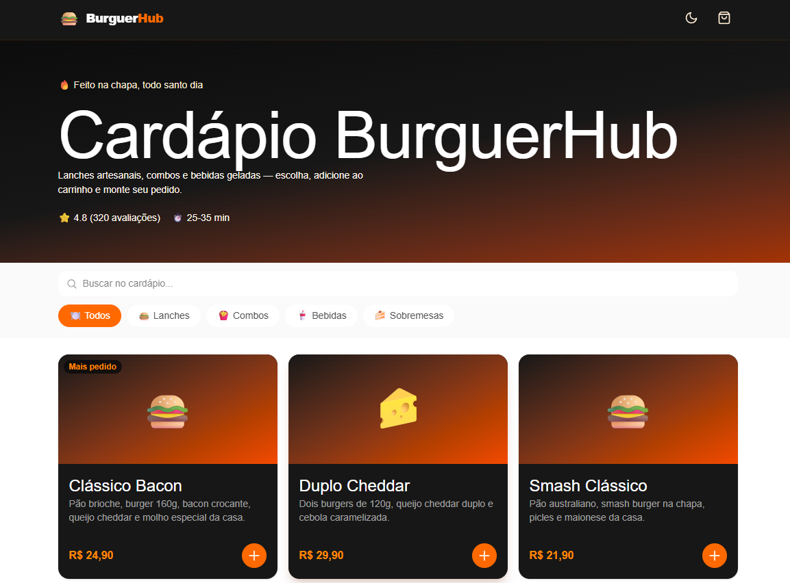

# 🍔 Cardápio Digital — BurguerHub

Cardápio digital de uma hamburgueria fictícia, feito como projeto de portfólio com **Nuxt 4**, **Vue 3** e **Tailwind CSS v4**.

O cliente navega pelo cardápio, busca e filtra itens, vê os detalhes de cada produto, monta o pedido no carrinho e alterna entre tema claro e escuro. A interface é pensada primeiro para o celular (mobile-first), já que é assim que um cardápio digital costuma ser acessado (por exemplo, via QR Code na mesa).



## ✨ Funcionalidades

- 🍽️ **Catálogo por categoria**: Lanches, Combos, Bebidas e Sobremesas, com selos como "Mais pedido" e "Vegetariano".
- 🔎 **Busca em tempo real** por nome ou descrição, combinável com o filtro de categoria.
- 🪟 **Modal de detalhes** do item, com escolha de quantidade antes de adicionar.
- 🛒 **Carrinho lateral** para aumentar, diminuir ou remover itens, com total calculado automaticamente e formatado em reais (R$).
- ✅ **Finalização simulada** do pedido, com mensagem de confirmação.
- 🌗 **Modo escuro**: segue a preferência do sistema na primeira visita e salva a escolha do usuário no navegador.
- 📱 **Layout responsivo**, do celular ao desktop.

## 🛠️ Tecnologias

| Tecnologia | Uso |
| --- | --- |
| [Nuxt 4](https://nuxt.com/) | Framework base, auto-import de componentes e composables, estado compartilhado com `useState` |
| [Vue 3](https://vuejs.org/) | Componentes com Composition API (`<script setup>`) |
| [Tailwind CSS v4](https://tailwindcss.com/) | Estilização, tema escuro (`dark:`) e responsividade |
| [Quasar](https://quasar.dev/) | Dependência de UI incluída no projeto |

## 📁 Estrutura do projeto

```
app/
├── app.vue                 # Página principal: junta os componentes e faz a busca/filtro
├── assets/css/main.css     # Estilos globais e configuração do Tailwind
├── components/
│   ├── AppHeader.vue       # Cabeçalho com contador do carrinho e botão de tema
│   ├── HeroBanner.vue      # Banner de destaque da hamburgueria
│   ├── MenuToolbar.vue     # Campo de busca e filtros de categoria (fixo no topo)
│   ├── MenuItemCard.vue    # Card de cada item do cardápio
│   ├── ItemModal.vue       # Detalhes do item + escolha de quantidade
│   ├── CartDrawer.vue      # Carrinho lateral e finalização do pedido
│   └── AppIcon.vue         # Ícones SVG reutilizáveis
├── composables/
│   ├── useCart.js          # Lógica do carrinho (adicionar, remover, totais)
│   └── useDarkMode.js      # Tema claro/escuro com persistência no localStorage
├── data/
│   └── menu.js             # Categorias e itens do cardápio (dados mock)
└── utils/
    └── format.js           # Formatação de moeda (BRL)
```

## 🧠 Como funciona

- **Dados**: o cardápio fica em `app/data/menu.js`. Para trocar os produtos, basta editar essa lista: cada item tem `id`, `categoryId`, `name`, `description`, `price`, `emoji` e, opcionalmente, uma `tag`.
- **Carrinho**: o composable `useCart` guarda os itens em um estado compartilhado (`useState`). Assim, o contador do cabeçalho e o carrinho lateral mostram sempre os mesmos dados.
- **Tema**: o composable `useDarkMode` aplica a classe `dark` no `<html>` e salva a preferência no `localStorage`.

## 🚀 Como rodar

Pré-requisito: [Node.js](https://nodejs.org/) 20 ou superior.

```bash
# instalar as dependências
npm install

# servidor de desenvolvimento em http://localhost:3000
npm run dev

# build de produção
npm run build
npm run preview

# gerar versão estática (para hospedar em GitHub Pages, Netlify, Vercel etc.)
npm run generate
```

## 📌 Observação

Este é um projeto de portfólio com dados fictícios. Não há backend, pagamento nem envio real de pedidos: a finalização apenas simula a confirmação.
